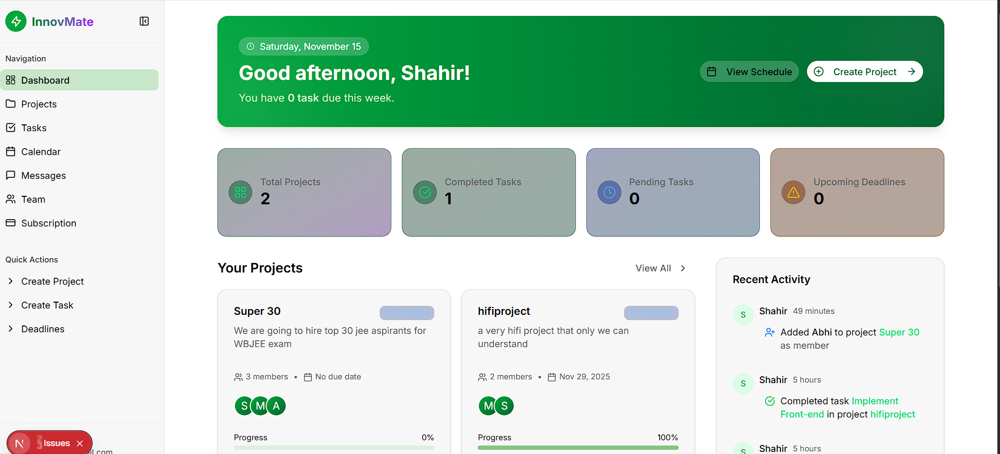
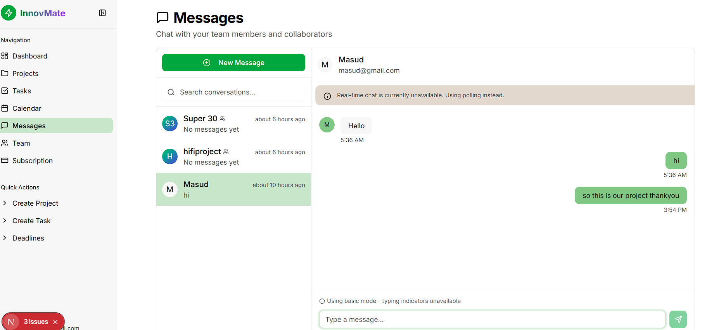
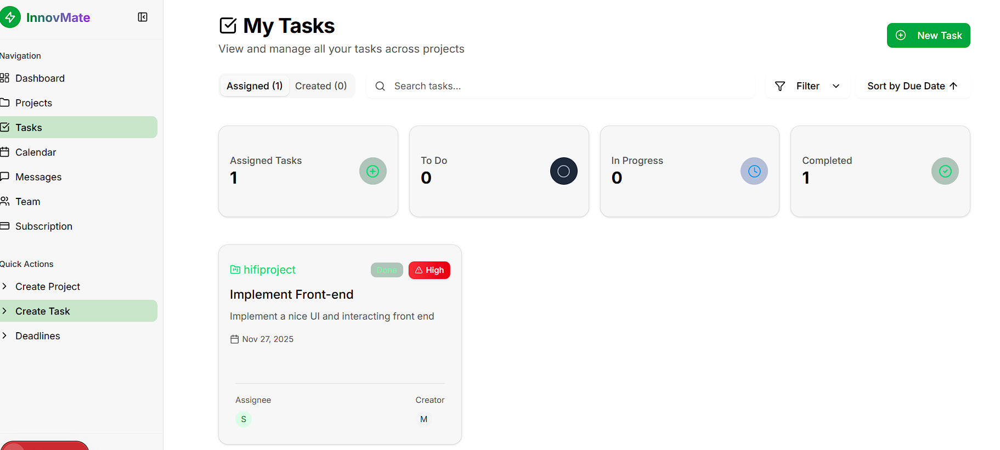

# InnovMate - Team Collaboration Hub

[](https://nextjs.org/)
[](https://expressjs.com/)
[](https://www.typescriptlang.org/)
[](https://www.postgresql.org/)


## What's This?

A full-featured workspace application that helps teams manage projects, chat in real-time, and stay organized. Built with modern web technologies and designed for seamless collaboration.

**Quick Note:** Email/password accounts need verification. Use Google or GitHub login for instant access.

## Core Capabilities

- 📊 **Project Workspaces** - Organize work across multiple projects
- 👥 **Team Coordination** - Invite colleagues and manage permissions
- ✅ **Task Tracking** - Create and monitor work items with priorities
- 💬 **Live Messaging** - Real-time chat for teams and individuals
- 📁 **File Sharing** - Upload and organize project documents
- 📅 **Timeline Views** - Kanban boards and calendar integration
- 💳 **Subscription Plans** - Flexible pricing with Stripe payments

## Pricing Structure

| Tier | Projects | Members | Storage | Cost |
|------|----------|---------|---------|------|
| Starter | 5 | 4 | 100MB | Free |
| Pro | 100 | 15 | 10GB | $29/mo |
| Enterprise | ∞ | ∞ | 100GB | $79/mo |

## Built With

**Client Side:** Next.js 15, TailwindCSS, NextAuth.js, React Hook Form  
**Server Side:** Node.js, Express, PostgreSQL, Prisma ORM, Socket.IO  
**Infrastructure:** Docker, Docker Compose


## Security Highlights

- 🔐 JWT authentication with bcrypt encryption
- 🛡️ Rate limiting (1000 req/15min)
- 🧹 XSS prevention via input sanitization
- 🔒 Helmet.js security headers
- ✉️ Email verification required
- 🚫 SQL injection protection

## Quick Setup

```bash
# Clone repository
git clone https://github.com/atkonisberg/project-collab-app.git
cd project-collab-app

# Configure environment
cp backend/.env.example backend/.env
cp frontend/.env.example frontend/.env

# Launch with Docker
docker-compose up

# Access at:
# Frontend: http://localhost:3000
# Backend: http://localhost:4000
```

## Environment Essentials

**Backend:**
- `DATABASE_URL` - PostgreSQL connection
- `JWT_SECRET` - Token encryption
- `STRIPE_SECRET_KEY` - Payment processing
- `RESEND_API_KEY` - Email delivery

**Frontend:**
- `NEXT_PUBLIC_API_URL` - Backend endpoint
- `NEXTAUTH_SECRET` - Session encryption
- `GOOGLE_CLIENT_ID/SECRET` - OAuth login
- `UPLOADTHING_SECRET` - File uploads

## Development Commands

```bash
# Run tests
npm test

# Test coverage
npm run test:coverage

# Watch mode
npm run test:watch

# Database management
npx prisma migrate dev
npx prisma studio
```

## Project Showcase

This application demonstrates expertise in:
- Scalable architecture design

- Real-time communication

- 🖼️ Photos Folder Preview — Screenshot of the Photos directory  

    
- Modern DevOps practices

- Comprehensive Task view

---

**Contact:** [GitHub](https://github.com/Shahir-habib/InnovMate) | **License:** MIT © 2025